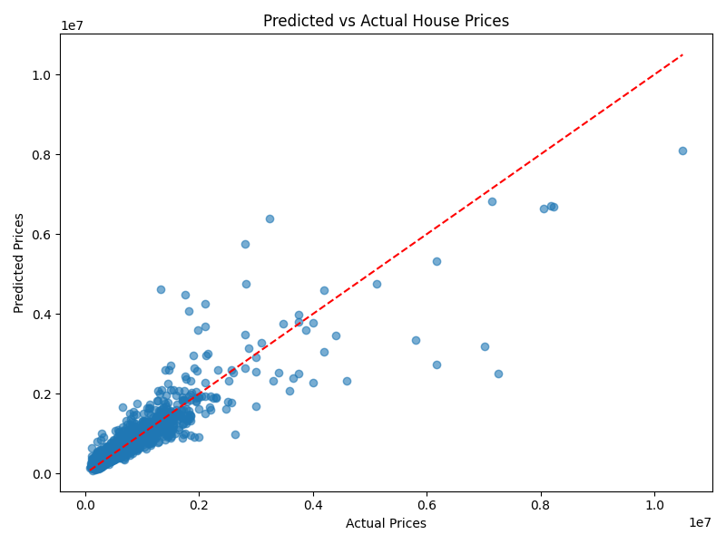

# 🏡 London House Price Prediction (Machine Learning)

📄 [View 1-page project summary](report/london-house-price-prediction-ml.pdf)

---

## 📌 Overview

This project builds a machine learning model to predict residential property prices across London, using location and property-level features to surface data-driven investment insights.

The objective goes beyond prediction accuracy — the goal is to understand *what drives price variation*, translate those findings into actionable decisions, and demonstrate how the same analytical framework applies to financial products at scale.

---

## 🎯 Business Problem

Accurately valuing assets is a core challenge across financial services. In real estate, mispricing leads to poor investment decisions and financial losses. The same problem exists in payments: correctly pricing risk, identifying high-value opportunities, and allocating capital to the right segments all require robust predictive models built on reliable data.

This project aims to:

- Predict property prices from key structural and geographic features
- Identify the main drivers of price variation across London boroughs
- Demonstrate how data can support investment and pricing decisions
- Apply that logic to select the top 200 highest-value out-of-sample investment opportunities

---

## 📊 Dataset

London residential property data including:

- Borough and postcode
- Distance to nearest tube station and London Zone
- Property type, tenure (freehold/leasehold), and age
- Total floor area and number of habitable rooms
- Water company (as a geographic proxy)

---

## 🔍 Approach

### 1. Exploratory Data Analysis (EDA)

- Analysed price distribution across London boroughs
- Identified geographic clusters, correlations, and outliers
- Assessed data quality and missing values

### 2. Data Preprocessing

- Handled missing values and inconsistencies
- Encoded categorical variables using One-Hot Encoding
- Applied log transformation to normalise price distribution

### 3. Feature Engineering

- Selected features with highest predictive signal
- Used permutation importance to validate feature relevance
- Prioritised model interpretability alongside performance

### 4. Model Development

Tested and tuned multiple models:

| Model | Notes |
|---|---|
| Ridge Regression | Baseline; strong on linear relationships |
| Decision Tree | Captures non-linear patterns |
| Random Forest | Ensemble; reduces overfitting |
| Gradient Boosting | High performance on structured data |
| **Stacking Ensemble** | **Best overall — combines all four models** |

The final **Stacking model** uses Ridge, Random Forest, and Gradient Boosting as base learners, with a Ridge meta-estimator to combine their predictions — improving generalisation over any single model.

### 5. Model Evaluation

Models were evaluated using:

- **RMSE** (Root Mean Squared Error) — measures average prediction error in £
- **R²** (R-squared) — measures how well the model explains price variation

The stacking model achieved the lowest cross-validated RMSE across all approaches.

Predictions closely follow actual values, with variance increasing at higher price points — a typical pattern in real-world housing data where luxury properties are harder to generalise.

### 6. Investment Decision Output

The final model was applied to an out-of-sample dataset of unseen properties. The top 200 highest predicted-value properties were flagged as investment opportunities — simulating a real product output delivered to an end user or account team.

---

## 📈 Key Insights

- **Location is the dominant price driver** — borough and London Zone account for the largest share of variation
- **Proximity to transport** significantly impacts valuations, particularly within Zone 1–2
- **Property size and room count** are strong secondary predictors
- **Stacking outperforms individual models**, validating the value of ensemble approaches for complex, noisy real-world data

---

## 💳 Relevance to Payments & Financial Products

The methodology in this project maps directly to product and data challenges in financial services:

| This Project | Payments / Visa Equivalent |
|---|---|
| Predicting property value from features | Predicting transaction risk or customer lifetime value |
| Borough as a pricing signal | Merchant category or geography as a fraud signal |
| Flagging top 200 investment properties | Identifying high-value merchant or consumer segments |
| Ensemble model combining multiple signals | Multi-model risk scoring in fraud prevention |
| Out-of-sample validation | Live model deployment on unseen transaction data |

This demonstrates the ability to frame a data science problem in terms of **business outcomes** — not just model metrics — which is central to product management in a data-led organisation.

---

## 🚀 Product Vision

If this were developed into a product, the roadmap would include:

1. **V1 — Internal tool**: Analyst-facing dashboard to score and rank properties by predicted value, integrated with internal data pipelines
2. **V2 — API layer**: Expose predictions via REST API so downstream teams (investment, risk, sales) can query in real time
3. **V3 — External product**: White-label pricing intelligence tool for bank or fintech partners, surfacing property and credit risk insights at the point of decision

This framing — from raw model to scalable, cross-functional product — reflects how data science creates value at the intersection of engineering, strategy, and go-to-market execution.

---

## 🛠️ Tech Stack

- Python
- Pandas, NumPy
- Scikit-learn (Pipeline, ColumnTransformer, StackingRegressor)
- Matplotlib / Seaborn

---

## 🔮 Future Improvements

- Deploy model as a REST API (FastAPI)
- Integrate external datasets: crime rates, school ratings, transport links
- Add real-time property data feeds
- Explore XGBoost and LightGBM for further performance gains
- Build an interactive front-end for non-technical stakeholders
